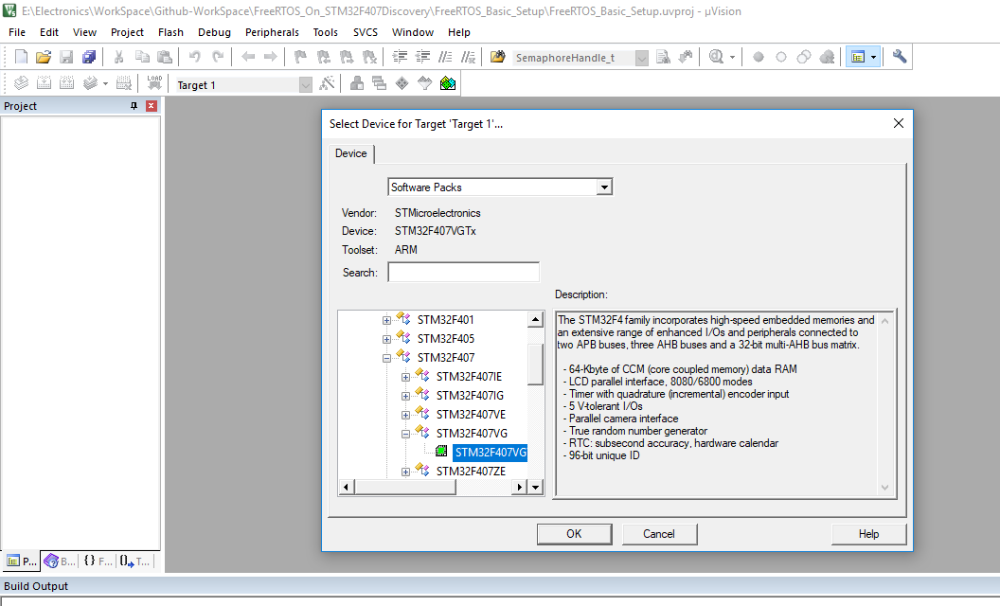
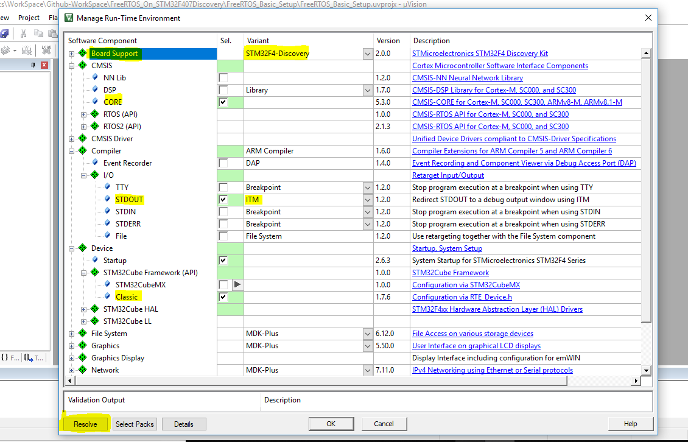
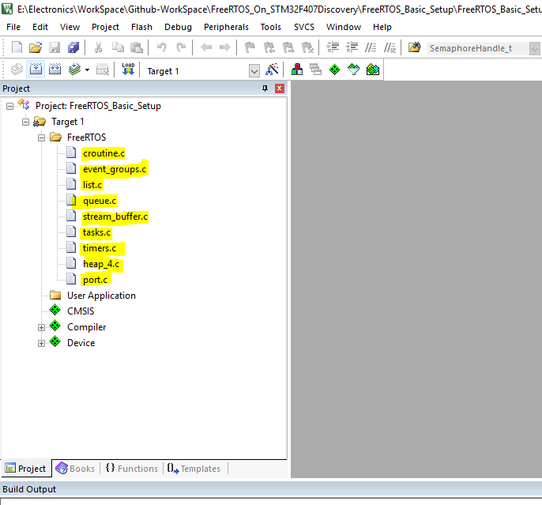
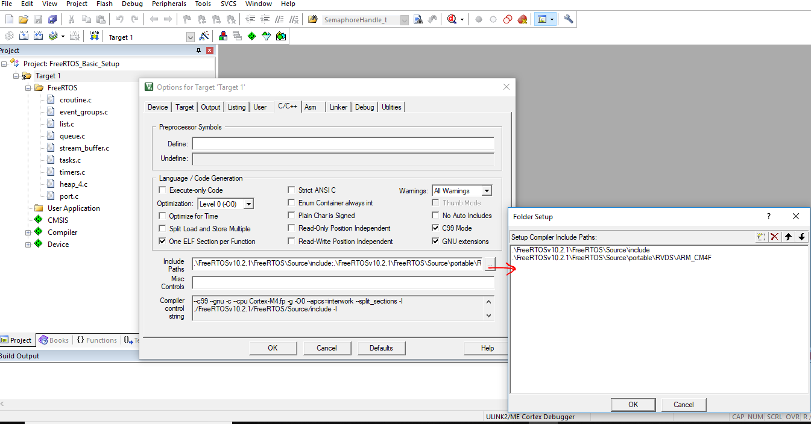

# Seeting up FreeRTOS on STM32F407 Discovery Kit
1. Open Keil uVision IDE. Click on **project** the select **New uVision Project.. **. Then select your working directory and give your preferred project name.
2. Now Select the device, in our case **STM32F407VG** MCU.

3. Now in the **Manage Run-Time Environment** Tab, make sure you select all the necessary driver/libraries as given below. Make sure you click **Resolve** after selecting all. 

4. Under Target1 add new Group **FreeRTOS**. Add all necessary FreeRTOS files to this group. As shown below:

   Path to find these files in FreeRTOS folder: 

   * **Files** : (croutine, event_groups, list, queue, stream_buffer, tasks, and timers)
 
     **Path** :  FreeRTOSv10.2.1\FreeRTOS\Source
 
   * **Files**: heap_4 ( You can add anyone memory management scheme of your choice) 
 
     **Path** : FreeRTOSv10.2.1\FreeRTOS\Source\portable\MemMang

   * **Files**: port.c (this is an MCU specific file)
 
     **Path** : FreeRTOSv10.2.1\FreeRTOS\Source\portable\RVDS\ARM_CM4F 

**Note**: FreeRTOS version may change. Just use the latest version available.

5. Now you need to add the path of all header files that are required. To do so, Right Click on **Target1**-> **Option for Target "Target1.."** -> **C/C++** -> **Include path**. Make sure you inclue these paths : 

* Include folder in FreeRTOS ( ......\FreeRTOSv10.2.1\FreeRTOS\Source\include)
* RVDS directory (.......\FreeRTOSv10.2.1\FreeRTOS\Source\portable\RVDS\ARM_CM4F)

**Note** : If you have any header files, make sure you include the path of these header files as explained above.

6. 
