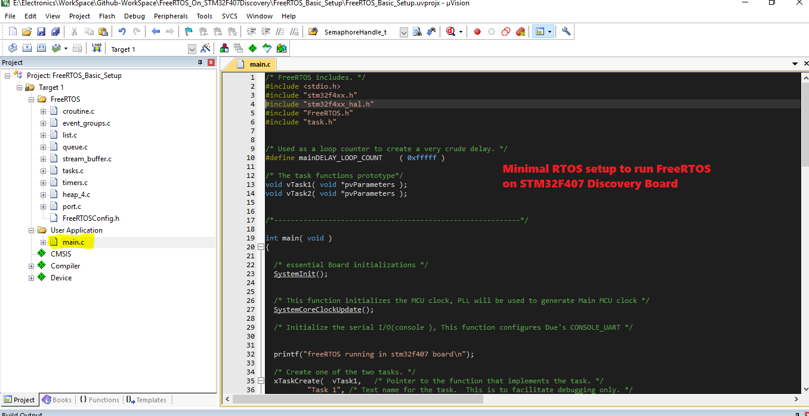
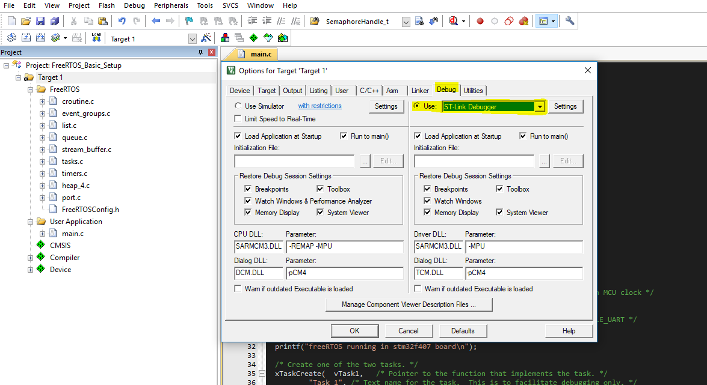
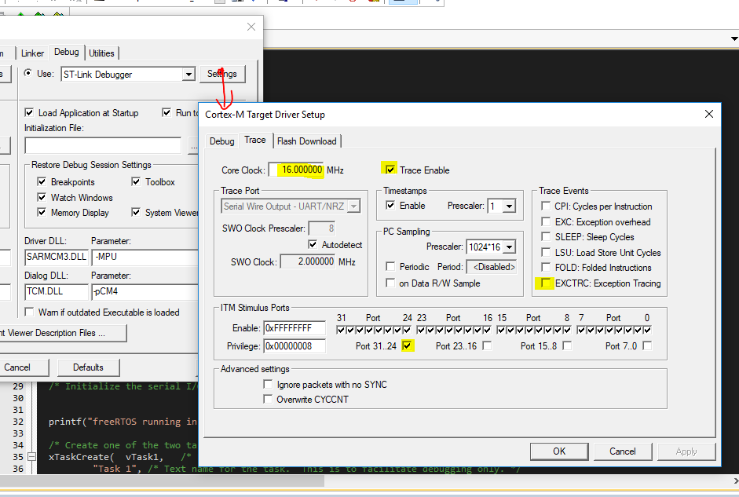
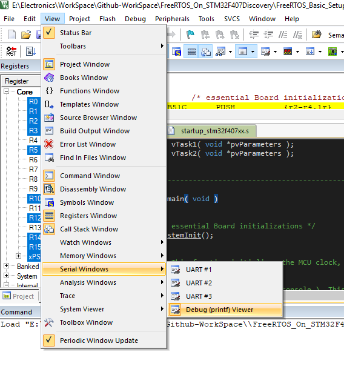
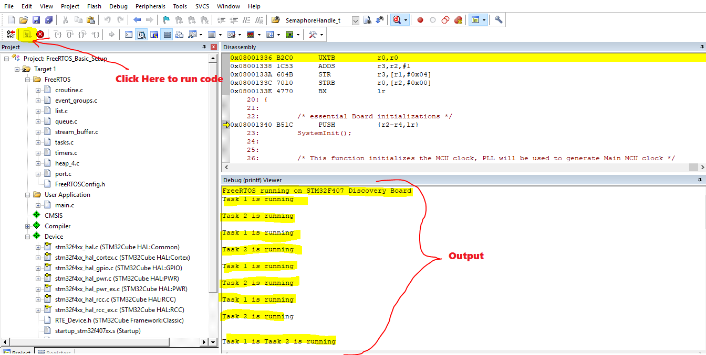

# Seeting up FreeRTOS on STM32F407 Discovery Kit
**FreeRTOS Basic Set up complete Keil project --> [FreeRTOS_Basic_Setup](https://github.com/SharathN25/FreeRTOS_On_STM32F407Discovery/tree/master/Seeting%20up%20FreeRTOS/FreeRTOS_Basic_Setup)**

## Steps to set up FreeRTOS
1. Open Keil uVision IDE. Click on **project** the select **New uVision Project.. **. Then select your working directory and give your preferred project name.
2. Now Select the device, in our case **STM32F407VG** MCU.

3. Now in the **Manage Run-Time Environment** Tab, make sure you select all the necessary driver/libraries as given below. Make sure you click **Resolve** after selecting all. 

4. Under Target1 add new Group **FreeRTOS**. Add all necessary FreeRTOS files to this group. As shown below:

   Path to find these files in FreeRTOS folder: 

   * **Files** : (croutine, event_groups, list, queue, stream_buffer, tasks, and timers)
 
     **Path** :  FreeRTOSv10.2.1\FreeRTOS\Source
 
   * **Files**: heap_4 ( You can add anyone memory management scheme of your choice) 
 
     **Path** : FreeRTOSv10.2.1\FreeRTOS\Source\portable\MemMang

   * **Files**: port.c (this is an MCU specific file)
 
     **Path** : FreeRTOSv10.2.1\FreeRTOS\Source\portable\RVDS\ARM_CM4F 

**Note**: FreeRTOS version may change. Just use the latest version available.

5. Now you need to add the path of all header files that are required. To do so, Right Click on **Target1**-> **Option for Target "Target1.."** -> **C/C++** -> **Include path**. Make sure you inclue these paths : 

   * Include folder in FreeRTOS ( ......\FreeRTOSv10.2.1\FreeRTOS\Source\include)
   * RVDS directory (.......\FreeRTOSv10.2.1\FreeRTOS\Source\portable\RVDS\ARM_CM4F)

   **Note** : If you have any header files, make sure you include the path of these header files as explained above.

6. FreeRTOS has one important header file called **FreeRTOSConfig.h**. This file contains the application-specific(in our case-specific to Cortex M4F MCU) customization. For simplicity, I have copied our MCU specific "FreeRTOSConfig.h" file in the **RVDS** directory also in step5 we have already added RVDS path. IF you're adding it yourself then You have to add this file in your project and also make sure you include the path of this file as explained in step 5. 

7. Now under User Application Group add a new **C file**. In the repository **main.c** file has the basic template so that the FreeRTOS application compiles successfully.  So please use this basic code in the main function for the successful compilation of the FreeRTOS application.

8. Connect your STM32F407 Kit to PC/Laptop.

9. In kiel uVison Right Click on **Target1**-> **Option for Target "Target1.."**-> **Debug**-> Select **ST-Link-Debugger** as shown below.

10. As shown in step 9, after selecting the ST-link-Debugger Click on **Settings** -> Select **Trace** and check all the fields as shown below:

11. Upload the Code to board. After uploading go to **debug-window**->**view**->**Serial Windows**->**Debug(printf) Viewer**. As shown below

12. Now run the code to see the output on the Debug printf window. (Here the application creates two tasks and inside these tasks, it simply prints the name of task)

**Note** : I have deleted all other files in the FreeRTOS folder except the one which are needed for this project. 
